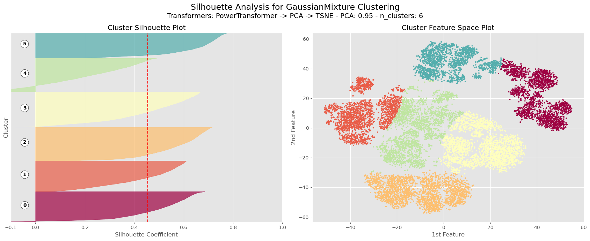
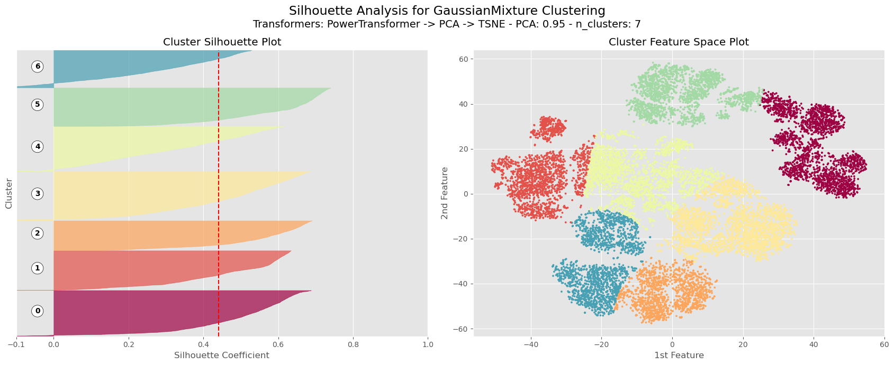

# Starbucks Customer Segmentation

Customer segmentation for Starbucks Rewards members using unsupervised learning. The goal of this project is to understand how different customer groups behave during promotional and non-promotional periods so marketing can be tailored more effectively.

## Project Overview

This notebook project builds a customer-offer engagement dataset from the Starbucks simulator data and uses clustering to segment customers into meaningful groups. The final model uses a KMeans pipeline over engineered customer features and compares cluster behavior across spend, offer response, and RFM-style activity scores.

The main deliverable is a set of customer segments that can be used for targeted promotions, retention strategy, and campaign planning.

## Data Sources

The project uses three JSON sources from the `Dataset/` folder:

- `portfolio.json` - offer metadata such as offer type, duration, difficulty, reward, and channels.
- `profile.json` - demographic profile data for customers.
- `transcript.json` - event log for transactions, offer views, offer receipts, and offer completions.

## Modeling Workflow

The notebook follows this flow:

1. Load and clean the raw JSON datasets.
2. Remove unusable profile rows and standardize identifiers.
3. Build offer and transaction engagement features per customer.
4. Aggregate the data into a final customer-offer engagement table named `coe`.
5. Transform features using `PowerTransformer`.
6. Reduce dimensionality with `PCA` while retaining 95% explained variance.
7. Fit `KMeans` and evaluate cluster quality with silhouette and elbow-style analysis.
8. Inspect the resulting clusters with spend, RFM, income, age, gender, and offer-response plots.

## Model Architecture

The final modeling pipeline is:

`Raw JSON inputs -> cleaning and feature engineering -> customer-offer engagement table -> PowerTransformer -> PCA -> KMeans clustering -> cluster analysis`

Key implementation details:

- Final modeling table: 39 features and 14,608 samples.
- Dimensionality reduction target: 95% PCA explained variance.
- Chosen clustering model: `KMeans`.
- Chosen cluster count: 6.

## Key Insights

### 1. Demographic profile

The customer base is not uniform. Age and income are spread across a wide range, and the gender split is dominated by male customers with a smaller female and other-gender population. The notebook also identifies 2,175 problematic profile rows with missing demographic information and the placeholder age value 118.

### 2. Non-promotional behavior

The strongest organically active segment is cluster 3, followed by cluster 1. In the notebook, cluster 3 has the highest non-promotional RFM score with a mean of 2.83 and median of 3.00, while cluster 1 follows with a mean of 2.58 and median of 3.00. Clusters 4 and 5 are the least valuable outside promotions, with mean RFM values of 0.89 and 0.56 respectively.

### 3. Promotional behavior

Promotions lift activity across all clusters, but not equally. Clusters 4 and 5 show the biggest lift from non-promotional to promotional periods, which makes them the clearest promotion-driven segments. Cluster 3 already behaves like a high-value organic group, so it is less dependent on offers to stay active.

### 4. Income and spend

Income helps explain some of the behavior differences. Cluster 3 has the highest mean income in the notebook at about $72,920, which aligns with its stronger non-promotional activity. Cluster 4 is also relatively high-income, but it is much more responsive to promotions than to ordinary activity. Cluster 1 is lower income, yet still moderately responsive across both periods.

### 5. Offer response

Offer response differs by cluster and offer type. View and completion behavior are not uniform, which means the same offer format does not work equally well for every segment. The offer plots in the notebook show that some clusters respond strongly to promotion while others convert only after exposure or repeated views.

## Model Result

The notebook compares multiple cluster counts and concludes that 2, 6, and to a lesser extent 3 are the most reasonable choices, with 6 selected as the best practical compromise. The final KMeans model with 6 clusters achieves a silhouette score of about 0.11.

That score is not strong in an absolute clustering sense, and the notebook explicitly notes that the clusters overlap. Even so, the resulting segments are still interpretable and business-useful once the clusters are analyzed against spend, income, and offer-response behavior.

An exploratory GaussianMixture + t-SNE experiment was also tried in the notebook and produced a higher silhouette score, but the result was treated as secondary because of the instability and tuning sensitivity of t-SNE.

## Recommendations

- Target clusters 4 and 5 with promotion-first campaigns because they show the largest activity lift when offers are present.
- Treat cluster 3 as a high-value organic segment and use loyalty or premium-retention tactics rather than heavy discounting.
- Use cluster 1 for low-friction, lower-cost offers since it is moderately active but not the most lucrative segment.
- Keep analyzing offer type performance separately, since BOGO, discount, and informational offers clearly produce different response patterns.

## Visual Results

### Demographic Snapshot

### Engagement Insights

### Model Selection and Final Result

## Files

- `segmentation.ipynb` - full analysis and modeling notebook.
- `utilities.py` - helper functions used for preprocessing, plotting, and clustering analysis.
- `Dataset/` - raw data files used by the notebook.
- `assets/` - exported notebook figures used in this README.

## Notes

The final segments are useful for business interpretation even though the silhouette score is modest. This is a common outcome in real customer segmentation work where behavior is noisy and partially overlapping across groups.
