# Starbucks Customer Segmentation

Customer segmentation for Starbucks Rewards members using unsupervised learning.
This project turns raw Starbucks simulator events into customer behavior features, builds clusters with KMeans, and translates those clusters into marketing actions.

## Dashboard Summary

| Metric | Value | Why It Matters |
|---|---:|---|
| Input datasets | 3 JSON files | Combines customer profile, offers, and full event history |
| Final modeling rows | 14,608 | Strong customer coverage for segmentation |
| Engineered features | 39 | Captures demographics, spend, RFM, and offer response |
| Feature scaling | PowerTransformer | Stabilizes skewed behavior features |
| Dimensionality reduction | PCA (95% EV) | Compresses noise while preserving information |
| Clustering model | KMeans | Fast and interpretable for campaign operations |
| Final cluster count | 6 | Balanced tradeoff between separation and actionability |
| Final silhouette score | ~0.11 | Modest separation, but still business-usable segments |

## Project Flowchart

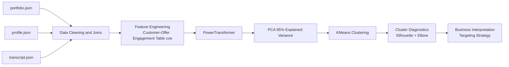

## Data Sources

The project uses three sources from `Dataset/`:

- `portfolio.json`: Offer metadata (type, duration, difficulty, reward, channels).
- `profile.json`: Customer demographics and membership details.
- `transcript.json`: Event stream (transactions, offer received/viewed/completed).

## Visual Story: Preprocessing to Outcome

### 1) Preprocessing and Data Understanding

Demographic spread and quality checks before modeling:

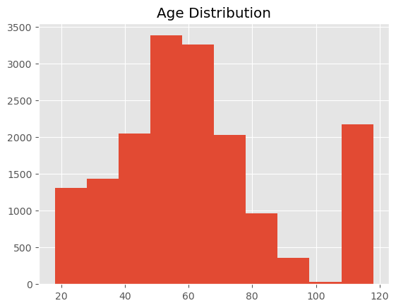
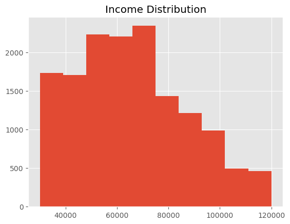
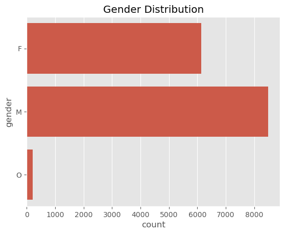

### 2) Feature Preparation and Dimensionality Reduction

PCA variance retention and component signal:

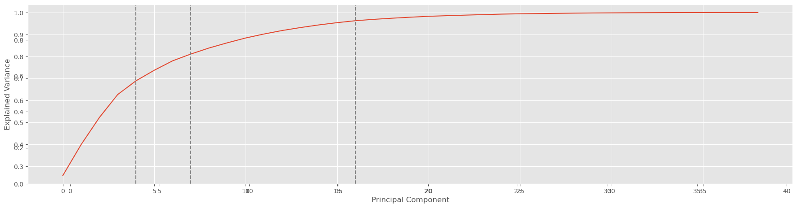
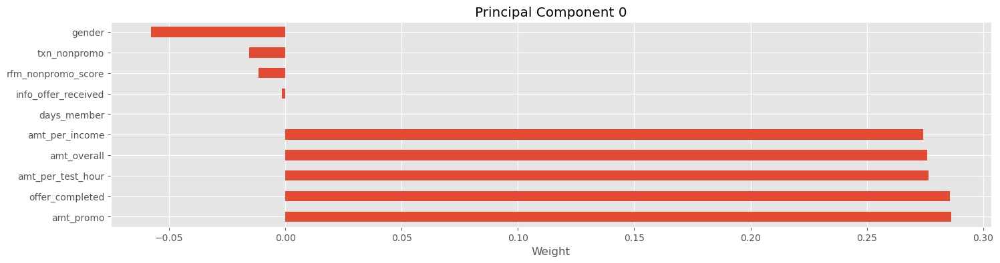
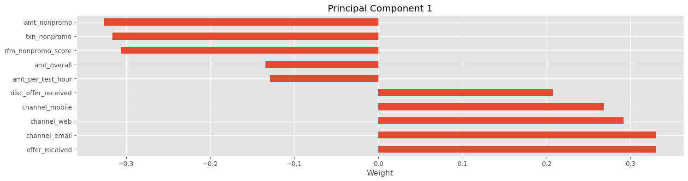

### 3) Model Selection

Choosing an actionable cluster count with silhouette + elbow diagnostics:

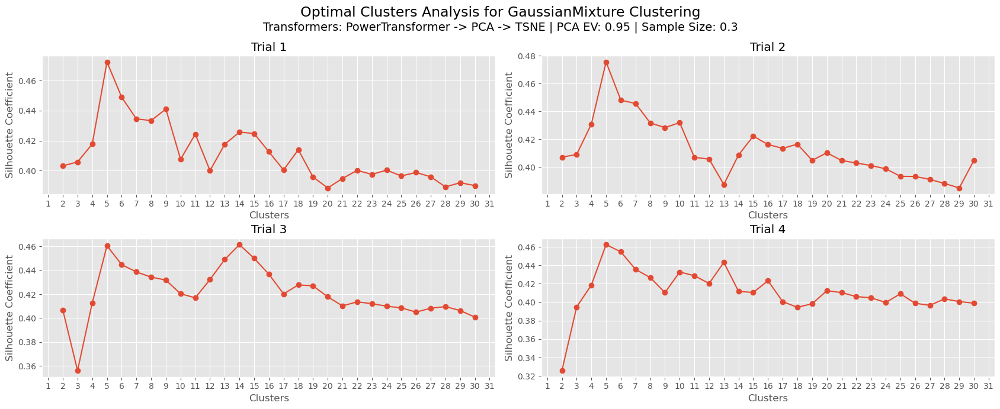
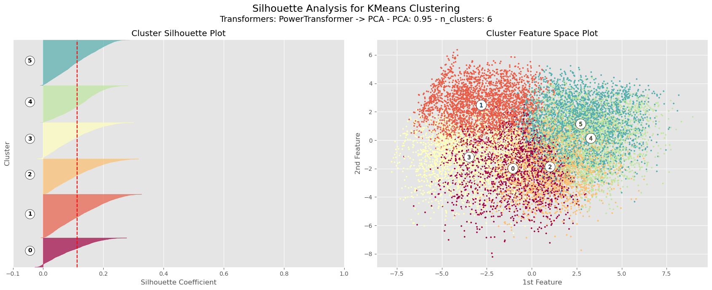

### 4) Segment Outcomes and Behavioral Results

Cluster-level response differences and campaign outcomes:

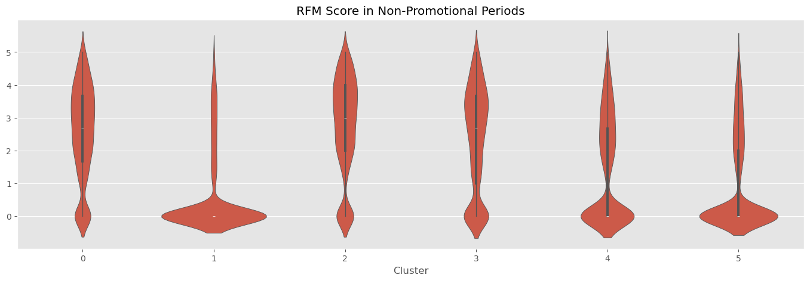
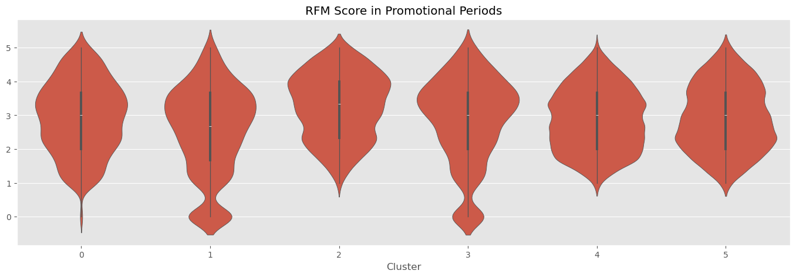
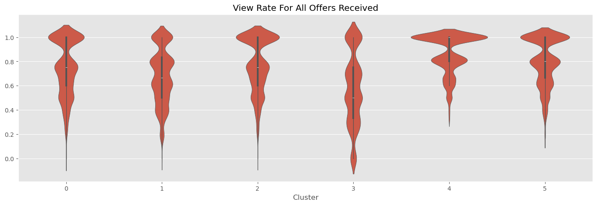
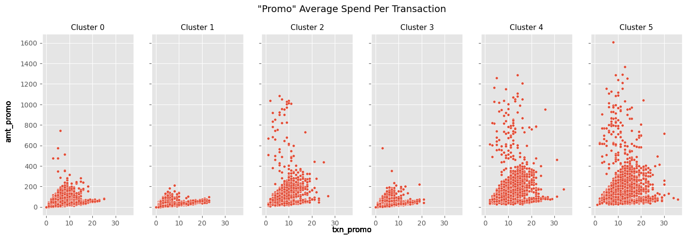

Additional cluster profiling views:

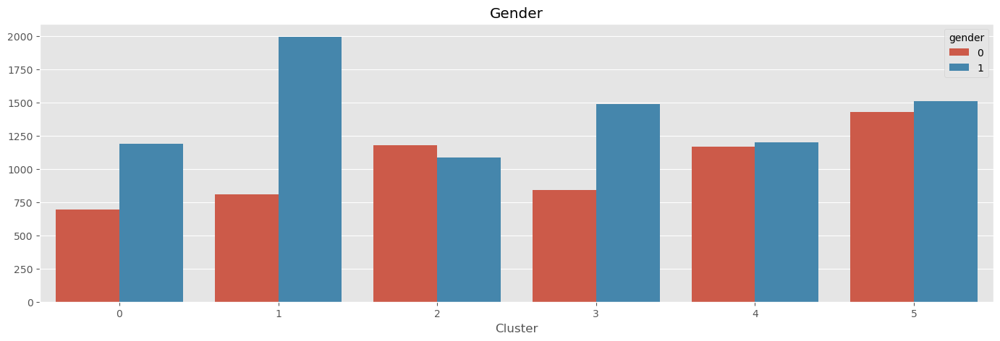
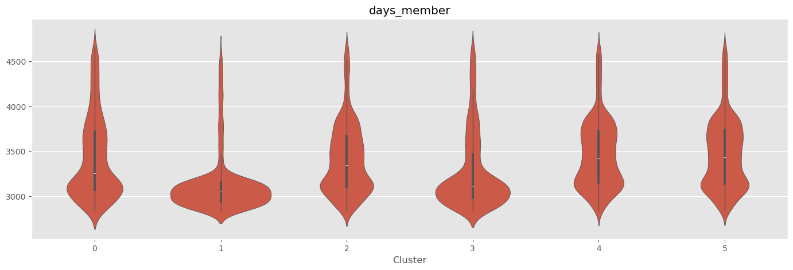

## Key Insights

### Segment behavior

- Cluster 3 behaves like a high-value organic segment (stronger non-promotional activity).
- Clusters 4 and 5 show the largest promotional lift, indicating promotion-driven behavior.
- Cluster 1 is moderate-value and suitable for lower-cost campaign formats.

### Offer strategy implications

- Offer response varies by cluster and offer type, so one-size-fits-all campaigns underperform.
- High organic segments are better served by loyalty and retention, not deep discounting.
- Promotion-dependent segments respond best to frequent, targeted offer timing.

## Recommended Actions

- Use promotion-first tactics for clusters 4 and 5.
- Protect margin in cluster 3 with loyalty perks instead of heavy discounts.
- Run low-friction campaigns for cluster 1 to maximize conversion efficiency.
- Keep offer-type analysis separate (BOGO, discount, informational) in future iterations.

## Repository Structure

- `segmentation.ipynb`: End-to-end analysis and clustering notebook.
- `utilities.py`: Helper utilities for preprocessing, plotting, and evaluation.
- `Dataset/`: Raw Starbucks simulator JSON files.
- `assets/`: Figures exported from notebook outputs.

## Final Note

While the silhouette score is modest, the six segments are interpretable and operationally useful for real-world campaign planning, where customer behaviors commonly overlap.
